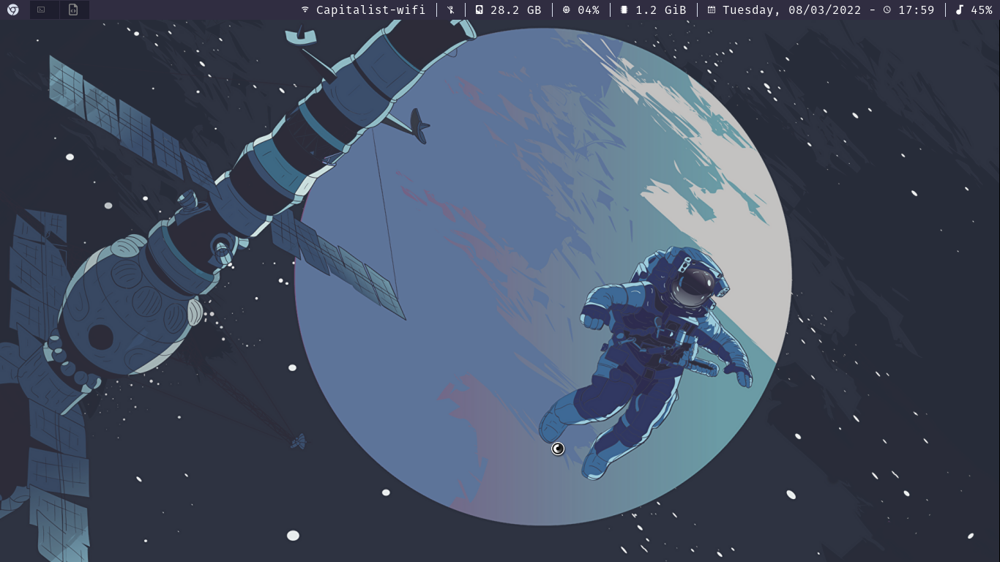
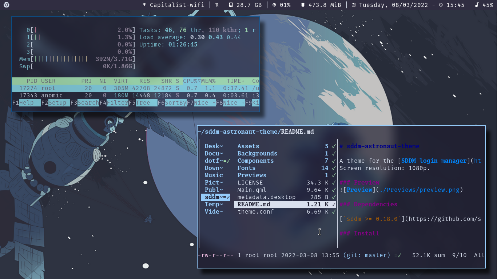
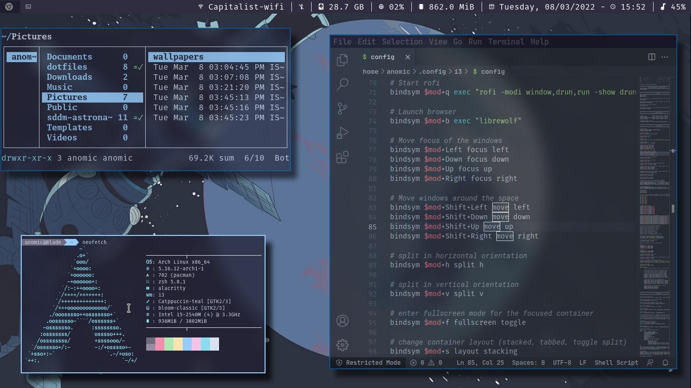
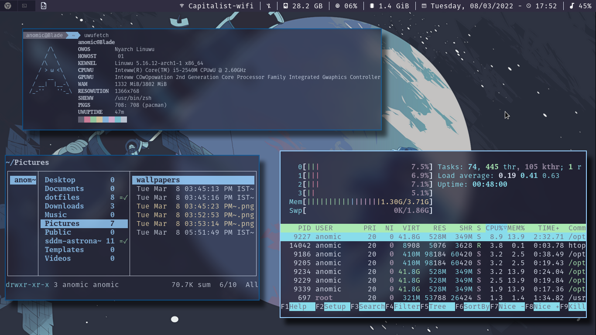
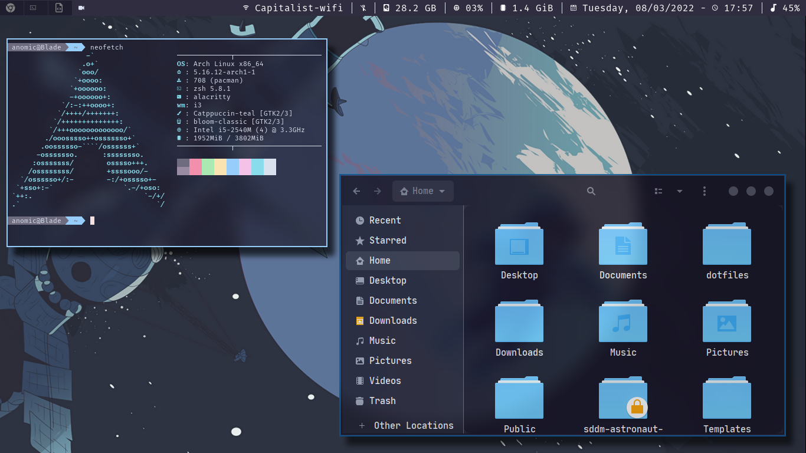
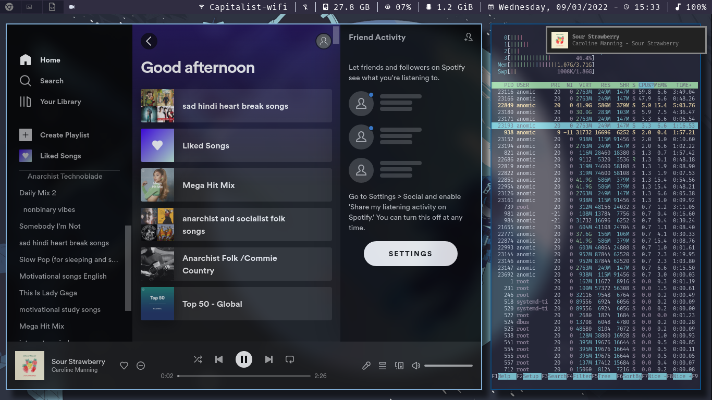

## Table of contents
* [Installation](#Installation)
* [Manual Installation](#Manual_Install)
* [Screenshots](#screenshots)
* [Key Bindings](#Key_Bindings)
## Installation
currently auto installation is only supported for arch linux and arch based distros.
clone the repo
```
git clone https://github.com/Anomic-cr/i3_dotfiles.git
```
And run the installation script
```
python install.py
```
and you should be good to go
## Manual Installation
Install the dependencies and copy the config files
### Dependencies
```
i3-gaps, sddm, betterlockscreen, i3status-git, i3blocks-git, alacritty, rofi-git, neofetch-git, polybar-git, dunst-git, feh-git, nitrogen, picom, lxappearance, xorg, xorg-xinit, xorg-server, qt5, oh-my-zsh, zsh
```
### Optional Dependencies
```
 neovim,vs code, python-pynvim, zsh zsh-completions,zsh-syntax-highlighting, zsh-autosuggestions, zsh-history-substring-search, zsh-history-substring-search-git, xclip maim, neofetch uwufetch, awesome-fonts-git, htop, nerd-fonts-complete-git, noto-fonts-emoji-git, noto-fonts-cjk-git, noto-fonts-extra-git, noto-fonts-extra-cjk-git, noto-fonts-mono-git, noto-fonts-symbols-git,
```
and now run the following cammands to copy the config files to your home directory
```
cp -r config ~/.config/
cp .bashrc ~/.bashrc
cp .zshrc ~/.zshrc
cp .Xresources ~/.Xresources
cp .xinitrc ~/.xinitrc
cp .local ~/.local
cp gtkrc-2.0 ~/.gtkrc-2.0
cp -r wallpapers/* ~/Pictures/wallpapers/
```
Set your sddm theme
```
git clone https://github.com/keyitdev/sddm-astronaut-theme.git
sudo cp /usr/share/sddm/themes/sddm-astronaut-theme/Fonts/* /usr/share/fonts/
echo "[Theme]
    Current = sddm-astronaut-theme" | sudo tee /etc/sddm.conf
```

Enable sddm service
```
sudo systemctl enable sddm.service
```
and then reboot your system
## Screenshots





## Key Bindings
Action  | Shortcut
------------- | -------------
Terminal  | Mod + Enter
Browser  | Mod + b
Floating mode  | Mod + Shift + space
Resize  | Mod + r
Move  | Mod + Shift + aroow/jkl;
rofi  | Mod + q
Foucs  | Mod + arrow keys
vertical split  | Mod + v
horizontal split  | Mod + h
fullscreen  | Mod + f
Switch to workspace  | Mod + 1-8
Screenshot  | print screen
Screenshot active window  | Mod + print screen

